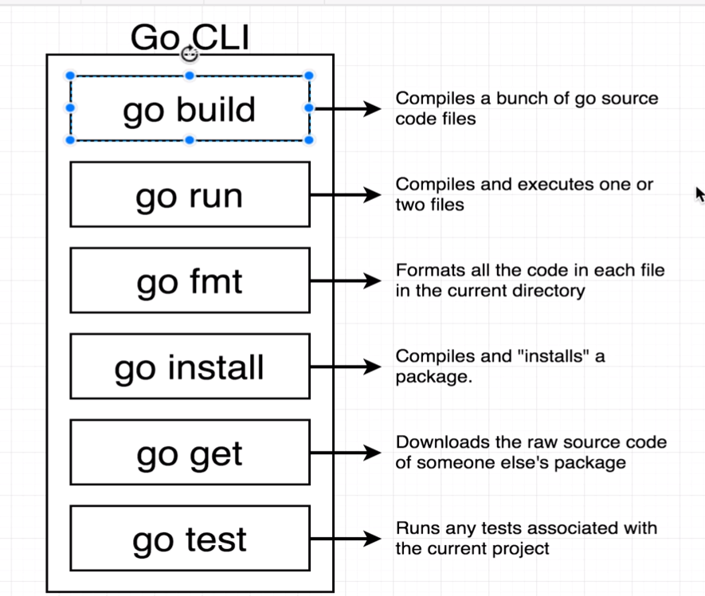
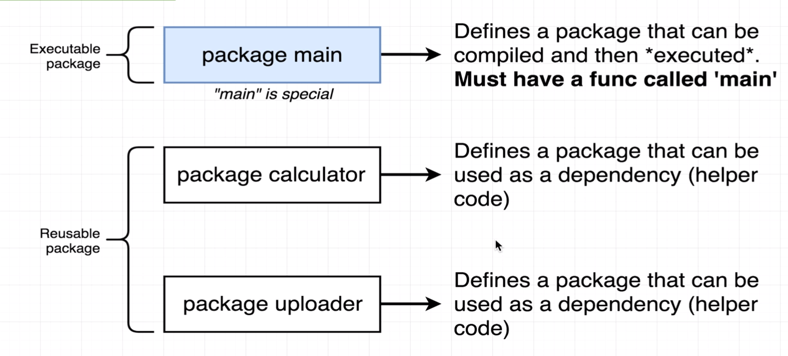
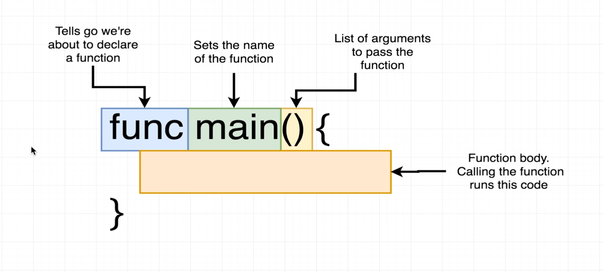
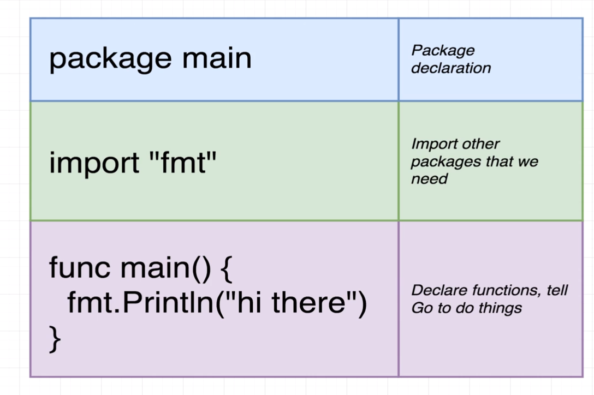
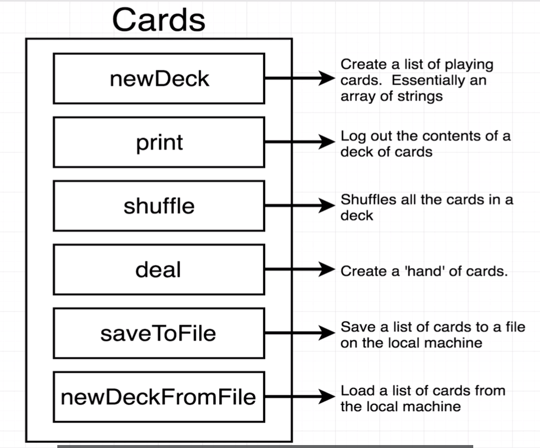
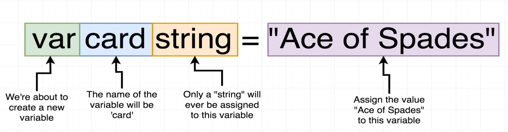
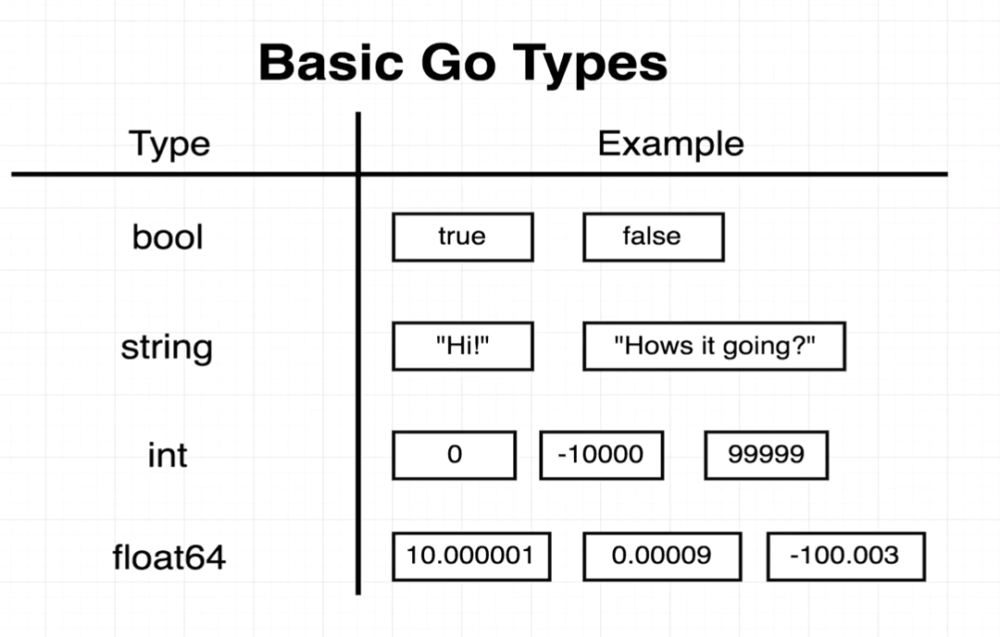
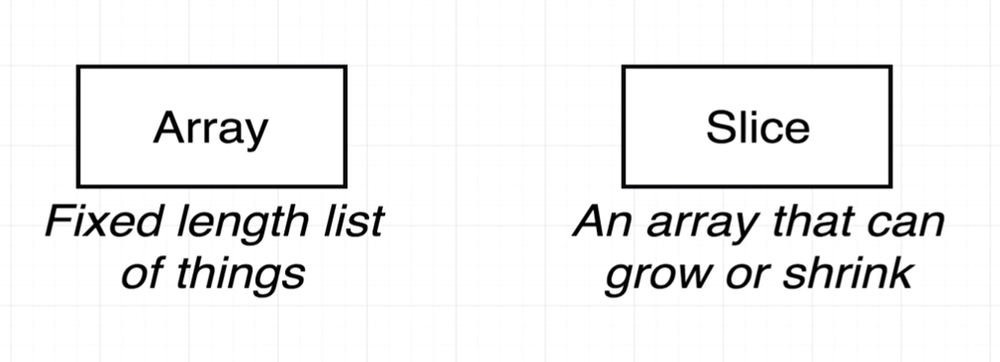
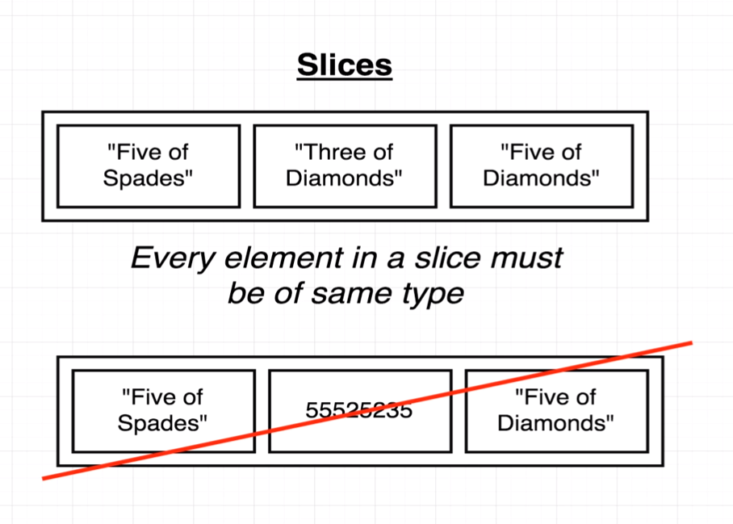
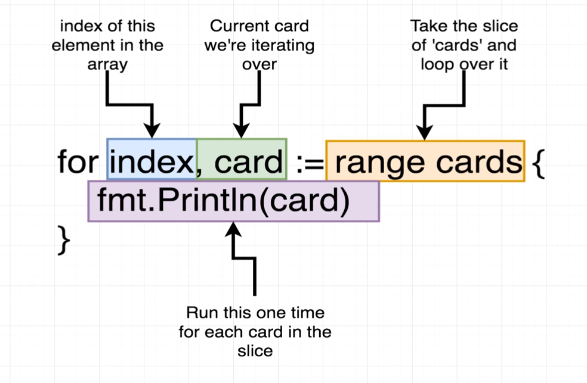

# go-the-complete-developers-guide
Master the fundamentals and advanced features of the Go Programming Language (Golang) - Udemy

## Module 1 - Simple Start
 ### - How do we run the code in our project?
   go run *file-name.go*
  
 ### - What does 'package main' mean?
   A package can have many files, but each of them must have in the first line declaring which package they belong to
   
   How do we know when we are making an executable or reusable package?
   - GO understands that package main are always a executable package, so when we run go build it will make an .exe file, but if we change it to another name (package something-else) go will not create a something-else.exe, so package main is sacred only used to create an executable file
 ### - What does 'import "fmt"' mean?
   Fmt is a standard library of go, but our main package does not have a link to it or any of its functions so we have to import it so our package knows any function inside the fmt package
   [Go standard packages documentation](https://pkg.go.dev/std)
 ### - What's that 'func' thing
   func is the function key word of golang language
   
 ### - How is the main.go file organized?
   

## Module 2 - Deeper into Go
  ### Project Cards
  

  - Variables
  

  - Basic Go Types
  

  - Arrays
  

  - Slices
  

  - Iterate a slice
  
  

### Deal with slice pkg 
https://github.com/samber/lo?tab=readme-ov-file
